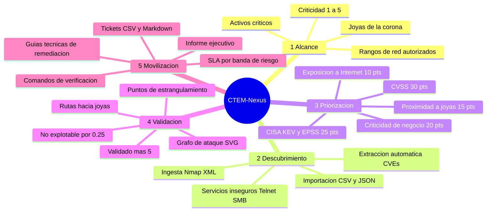
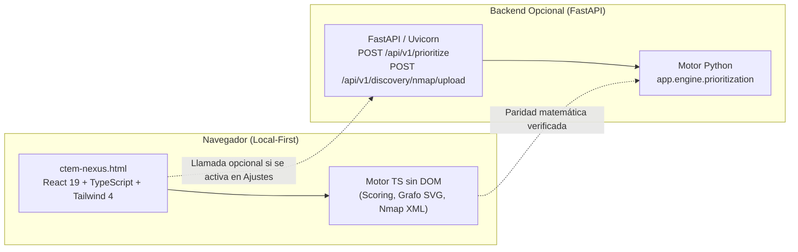

<p align="center">
  
</p>

<p align="center">
  <b>Plataforma de gestión continua de la exposición a amenazas: define el alcance, ingesta escaneos de red Nmap y vulnerabilidades, prioriza con cálculo explicable (CVSS · EPSS · KEV), calcula rutas de ataque hacia las joyas de la corona y moviliza la remediación con planes ejecutivos y técnicos.</b>
</p>

<p align="center">
  <a href="https://heindall92.github.io/ctem-nexus/"></a>
</p>

<p align="center">
  <a href="LICENSE"></a>
  
  
  
  
  
  
  
  
  
</p>

<p align="center">
  
</p>

CTEM-Nexus traslada el marco estratégico **CTEM** (*Continuous Threat Exposure Management*) propuesto por Gartner
a una herramienta de ciberseguridad táctica y visual. En lugar de inundar a los equipos con listas interminables de CVEs
desconectados de la realidad del negocio, CTEM-Nexus evalúa el riesgo en contexto y calcula una **puntuación transparente
de 0 a 100** para cada hallazgo:

- la **severidad técnica** (puntuación CVSS);
- la **explotación real en el mundo exterior** (catálogo CISA KEV, exploit público activo y probabilidad EPSS);
- la **criticidad de negocio** y la **exposición a Internet** del activo afectado;
- la **proximidad a las joyas de la corona**, computada en saltos sobre el grafo de ataque;
- el factor de **validación táctica** (bonificación por validación real o reducción drástica si se comprueba no explotable).

Asimismo, traza los caminos de intrusión desde Internet o la red perimetral hacia los activos más sensibles (criticidad 5)
e identifica automáticamente los **puntos de estrangulamiento** (*choke points*): nodos y aristas comunes donde una única
corrección defensiva rompe el mayor número de rutas de ataque.

**Modo de uso universal:** funciona íntegramente en el navegador como un único fichero HTML sin servidor y sin conexión
(cero telemetría, privacidad total), o conectado a su backend opcional en **FastAPI (Python)** para procesar ingestas
pesadas de auditoría.

<div align="center">

## `$ cat ctem-nexus.yaml`

<table>
  <thead>
    <tr>
      <th colspan="2" align="left"><code>ctem-nexus:~$ cat ctem-nexus.yaml</code></th>
    </tr>
  </thead>
  <tbody>
    <tr>
      <td width="50%" valign="top"><code>├─</code>  <code>ctem_fases:</code><br><br>
        
        
        <br>
        <sub><code>1. Alcance · 2. Descubrimiento · 3. Priorización · 4. Validación · 5. Movilización</code></sub>
      </td>
      <td width="50%" valign="top"><code>├─</code>  <code>motor_y_analisis:</code><br><br>
        
        
        
        <br>
        <sub><code>Scoring 0–100 · Grafo de ataque SVG · Joyas (crit. 5) · Puntos de estrangulamiento</code></sub>
      </td>
    </tr>
    <tr>
      <td valign="top"><code>├─</code>  <code>frontend_app:</code><br><br>
        
        
        
        <br>
        <sub><code>React 19 · TypeScript estricto · Tailwind CSS 4 · Single-File HTML</code></sub>
      </td>
      <td valign="top"><code>├─</code>  <code>backend_api:</code><br><br>
        
        
        <br>
        <sub><code>Python 3.12 · FastAPI · Pydantic v2 (camelCase) · Ingesta Nmap multipart</code></sub>
      </td>
    </tr>
    <tr>
      <td valign="top"><code>├─</code>  <code>pruebas_calidad:</code><br><br>
        
        <br>
        <sub><code>Vitest 52 pruebas · Pytest 19 pruebas · e2e 75 · axe-core 0 infracciones · Paridad exacta TS ↔ Python (golden-demo)</code></sub>
      </td>
      <td valign="top"><code>╰─</code>  <code>seguridad_privacidad:</code><br><br>
        <br>
        <sub><code>Cero terceros · CSP con hashes · Local-first · Saneado contra inyección de fórmulas</code></sub>
      </td>
    </tr>
  </tbody>
  <tfoot>
    <tr>
      <td colspan="2"><code>version: 0.4.0&nbsp;&nbsp;·&nbsp;&nbsp;motor: TS + FastAPI&nbsp;&nbsp;·&nbsp;&nbsp;Gartner CTEM&nbsp;&nbsp;·&nbsp;&nbsp;pruebas: Vitest 52 · Pytest 19 · e2e 75&nbsp;&nbsp;·&nbsp;&nbsp;licencia: GPLv2</code></td>
    </tr>
  </tfoot>
</table>

</div>

---

## Índice

- [Cómo se usa](#cómo-se-usa)
- [Ciclo CTEM y mapa mental](#ciclo-ctem-y-mapa-mental)
- [Vistas](#vistas)
- [Capturas](#capturas)
- [Ingesta activa con Nmap](#ingesta-activa-con-nmap)
- [Arranque rápido](#arranque-rápido)
- [Arquitectura](#arquitectura)
- [Método de cálculo y scoring](#método-de-cálculo-y-scoring)
- [Calidad y pruebas](#calidad-y-pruebas)
- [Seguridad y privacidad](#seguridad-y-privacidad)
- [Limitaciones conocidas](#limitaciones-conocidas)
- [Estructura del proyecto](#estructura-del-proyecto)
- [Hoja de ruta](#hoja-de-ruta)
- [Licencia](#licencia)
- [Autor](#autor)

---

##  Cómo se usa

CTEM-Nexus organiza el flujo de seguridad en las 5 etapas del ciclo continuo de Gartner:

1. **Alcance (*Scoping*):** Registra los activos críticos (nombre, tipo de infraestructura, IP/CIDR, responsable de área, criticidad 1–5, exposición a Internet y etiquetas) y los rangos de red autorizados. Los activos con criticidad 5 son designados como **joyas de la corona**.
2. **Descubrimiento (*Discovery*):** Ingesta reportes reales de escaneo **Nmap (XML)**, exportación **BloodHound AD**, archivos CSV o JSON estructurados, da de alta hallazgos manuales o carga el conjunto de datos de demostración para pruebas y capacitación.
3. **Priorización (*Prioritization*):** El motor correlaciona y ordena cada hallazgo con una puntuación explicable de 0 a 100. Abre cualquier elemento para inspeccionar el desglose de factores, la justificación textual y la guía de remediación paso a paso.
4. **Validación (*Validation*):** En el panel de *Rutas de ataque*, analiza el grafo interactivo, identifica los caminos de intrusión desde el exterior hasta las joyas de la corona y localiza los **puntos de estrangulamiento**. Marca cada hallazgo como **validado** (+5 puntos) o **no explotable** (reduce su riesgo a un 25 % y desconecta la arista).
5. **Movilización (*Mobilization*):** Genera informes ejecutivos en Markdown imprimibles para la dirección y exporta paquetes de tickets de ingeniería (en CSV o Markdown) con comandos de verificación y SLAs por banda de riesgo.

##  Ciclo CTEM y mapa mental



##  Vistas

| | Vista | Contenido y propósito |
|---|---|---|
|  | **Panel** | **Franjas de exposición por activo** (cada hallazgo situado por su puntuación sobre las bandas), índice de exposición, **tres acciones para hoy** ordenadas por las rutas que rompen, indicadores clave, ciclo CTEM y riesgos principales. |
|  | **Alcance y activos** | Inventario de activos críticos, asignación de responsabilidades, rangos de subred y botón de ingesta de escaneos Nmap XML para alta automatizada de infraestructura. |
|  | **Descubrimiento y priorización** | Tabla dinámica con filtrado por severidad, búsqueda, importación (Nmap XML / CSV / JSON) y cajón lateral con desglose exhaustivo de puntuación y SLA. |
|  | **Rutas de ataque** | Grafo de ataque con zoom, desplazamiento y modo «solo esta ruta», puntos de estrangulamiento, rutas enumeradas y validación de explotabilidad. |
|  | **Movilización** | Informe ejecutivo con portada para imprimir o guardar en PDF ([ejemplo](docs/informe-ejemplo.pdf)), tickets con responsable, pasos con casillas, comando de verificación y fecha límite, y exportación en CSV y Markdown. |
|  | **Ajustes y datos** | Configuración del proyecto, selección del motor de cálculo (local en navegador o API FastAPI), exportación/importación completa en JSON y borrado seguro de datos. |

##  Capturas

### Escritorio · modo oscuro

| | |
|---|---|
|  |  |
| **Panel central de exposición y ciclo CTEM** | **Descubrimiento y priorización explicable** |
|  |  |
| **Detalle analítico y desglose de factores** | **Grafo de rutas y puntos de estrangulamiento** |
|  |  |
| **Movilización, informes ejecutivos y tickets** | **Alcance, activos críticos y subredes** |

### Escritorio · modo claro

| | |
|---|---|
|  |  |
| **Panel central de exposición y ciclo CTEM** | **Descubrimiento y priorización explicable** |
|  |  |
| **Detalle analítico y desglose de factores** | **Grafo de rutas y puntos de estrangulamiento** |
|  |  |
| **Movilización, informes ejecutivos y tickets** | **Alcance, activos críticos y subredes** |

### Móvil · modo oscuro

| | |
|---|---|
|  |  |
| **Panel** | **Priorización** |
|  |  |
| **Detalle de un hallazgo** | **Rutas de ataque** |
|  |  |
| **Movilización** | **Alcance y activos** |

### Móvil · modo claro

| | |
|---|---|
|  |  |
| **Panel** | **Priorización** |
|  |  |
| **Detalle de un hallazgo** | **Rutas de ataque** |
|  |  |
| **Movilización** | **Alcance y activos** |

##  Ingesta activa con Nmap

CTEM-Nexus integra un analizador de escaneos de red **Nmap XML (`-oX`)** tanto en el motor de TypeScript para ejecución cliente sin servidor como en el backend de FastAPI:

### 1. Ejecutar el escaneo en Nmap
Genera el reporte XML con detección de versiones y scripts básicos de auditoría:

```bash
# Escaneo de red interna o perimetral con exportación XML
nmap -sV -sC -p- -T4 -oX auditoria_red.xml 192.168.1.0/24

# Escaneo específico con scripts de vulnerabilidades (vulners / nse)
nmap -sV --script vuln -oX escaneo_vulnerabilidades.xml 10.10.10.0/24
```

### 2. Qué procesa automáticamente CTEM-Nexus
- **Identificación de Activos:** Extrae IPs activas, nombres de host DNS y puertos abiertos como etiquetas de contexto.
- **Inferencia de Tipo y Criticidad:**
  - Si detecta Kerberos (88) o LDAP (389/636), clasifica el nodo como `controlador_dominio` y asigna **criticidad 5 (Joya de la corona)**.
  - Si detecta bases de datos (PostgreSQL, MySQL, MSSQL, Oracle), clasifica como `base_datos` (criticidad 4).
  - Si la IP no pertenece a rangos privados (RFC 1918), clasifica como `perimetro` y marca `internetExposed = true`.
- **Generación de Hallazgos y Rutas:**
  - Extrae CVEs presentes en la salida de scripts NSE (ej. `CVE-2023-4966`, `CVE-2021-44228`).
  - Detecta protocolos en texto plano (Telnet en puerto 23) y exposición de SMB (puerto 445).
  - Sugiere automáticamente los rangos de subred descubiertos para la fase de Alcance.

##  Arranque rápido

### Opción 1: Un solo fichero HTML (Recomendado)
Descarga [`ctem-nexus.html`](ctem-nexus.html) y ábrelo con doble clic en tu navegador preferido. No requiere Node.js, Python ni conexión a Internet.

### Opción 2: Entorno de desarrollo de la interfaz (Node.js ≥ 20)
```bash
cd frontend
npm install
npm run dev          # Servidor de desarrollo en http://localhost:5173
npm test             # Ejecuta las pruebas unitarias del motor (Vitest)
npm run build        # Compila el paquete y genera el single-file ctem-nexus.html
```

### Opción 3: Backend opcional con FastAPI (Python ≥ 3.11)
```bash
cd backend
python -m venv .venv
# En Windows (PowerShell):
.\.venv\Scripts\Activate.ps1
# En Linux/macOS:
source .venv/bin/activate

pip install -r requirements-dev.txt
pytest                                       # Ejecuta pruebas de API y paridad
uvicorn app.main:app --reload --port 8000    # Documentación Swagger en http://127.0.0.1:8000/docs
```

Una vez levantado el backend, ve a **Ajustes y datos › Motor de cálculo** en la interfaz y activa la casilla *Usar la API*. Si el servidor no responde, la aplicación conmuta automáticamente al motor local.

##  Arquitectura



- **Frontend:** React 19, TypeScript estricto, Tailwind CSS 4, Motion, Zustand y Lucide. Compilado con `vite-plugin-singlefile` en un único archivo HTML con fuentes Geist incrustadas.
- **Motor:** `frontend/src/engine/` calcula puntuaciones, construye grafos, halla choke points y normaliza ficheros sin tocar el DOM.
- **API:** FastAPI con routers modulares por fase CTEM y modelos Pydantic v2 en camelCase (el mismo esquema consumido por React).
- **Paridad exacta:** `shared/golden-demo.json` asegura que ambos motores produzcan idéntico resultado a nivel de décimas.

##  Método de cálculo y scoring

El algoritmo de priorización calcula una puntuación de exposición $S \in [0, 100]$:

$$\text{Puntuación} = \left(\frac{\text{CVSS}}{10} \times 30\right) + \left(\max(\text{KEV},\, 0.6 \cdot \text{exploit},\, \text{EPSS}) \times 25\right) + \left(\frac{\text{criticidad} - 1}{4} \times 20\right) + (\text{expuesto} \times 10) + \left(\max(0,\, 1 - \frac{\text{saltos}}{4}) \times 15\right)$$

- **Modificador de validación:** Si el hallazgo está **validado**, suma $+5$ puntos (tope 100). Si se marca como **no explotable**, se multiplica por $\times 0.25$ y se desvincula de las rutas de ataque.
- **Bandas y SLAs recomendados:**
  - **Crítica** ($\ge 80$): SLA de remediación de **3 días**.
  - **Alta** ($\ge 60$): SLA de **14 días**.
  - **Media** ($\ge 40$): SLA de **30 días**.
  - **Baja** ($< 40$): SLA de **90 días**.

Detalles completos y ejemplo resuelto en [`docs/SCORING.md`](docs/SCORING.md).

##  Calidad y pruebas

- **Motor TypeScript:** 52 pruebas con Vitest (fórmulas, clasificaciones, grafo, rutas, estrangulamientos, parseador Nmap XML, BloodHound, importaciones CSV/JSON, fichero dorado, rechazo de XML con entidades, plazos de SLA, impacto de cada corrección sobre las rutas, progreso de remediación, ficheros de ejemplo, explicaciones, guías y exportaciones en inglés, paridad de los diccionarios ES/EN y coherencia del repositorio).
- **Motor Python y API:** 19 pruebas con Pytest (endpoints de FastAPI, carga multipart de Nmap, rechazo de XML con entidades, neutralización de fórmulas CSV y paridad con `shared/golden-demo.json`).
- **Navegador (e2e):** 75 comprobaciones con Playwright sobre el HTML autocontenido (`tests/e2e_app.py`): CSP, red bloqueada, navegación, ingesta de Nmap real y con entidades, BloodHound, rutas que se cortan al validar, SLA vencidos, exportar y reimportar, diálogos con Escape y foco, fórmula de la ayuda igual a la del motor, franjas de exposición y tres acciones para hoy, zoom y «solo esta ruta» en el grafo, pasos con casillas, informe impreso en PDF, tema, inglés completo en 14 pantallas y móvil con tarjetas.
- **Accesibilidad:** axe-core (WCAG 2.2 A/AA) en 144 estados (36 por combinación: vistas, diálogos, menús, formularios, resultados de ingesta, ayuda y búsqueda, en claro y oscuro, a 1440 y 390 px), más un barrido de contraste propio para lo que axe deja sin decidir: **0 infracciones** (`tests/a11y_app.py`), incluido el tamaño mínimo de 24 × 24 px de los objetivos táctiles. Ambas suites se ejecutan en la CI.
- **Lighthouse** (servido con gzip, como en GitHub Pages): rendimiento 97 · accesibilidad 100 · buenas prácticas 100 · SEO 100.
- **Compilación e integridad:** TypeScript en modo estricto (`tsc -b`). La CSP del archivo único prohíbe scripts externos y evalúa hashes criptográficos.

##  Seguridad y privacidad

- **Cero dependencias externas en tiempo de ejecución:** Fuentes autoalojadas e incrustadas en base64; sin CDNs externos, sin Google Analytics y sin telemetría.
- **Política de Seguridad de Contenido (CSP) estricta:** `default-src 'none'`, estilos y scripts autorizados exclusivamente por hash SHA-256, y conexiones limitadas a `localhost` para la API opcional.
- **Protección contra inyección de fórmulas CSV:** Toda celda que comience por caracteres peligrosos (`=`, `+`, `-`, `@`, `\t`, `\r`) es neutralizada con apóstrofe inicial en la interfaz y en el backend.
- **Análisis defensivo:** Sanitización de claves prohibidas (`__proto__`, `constructor`, `prototype`) al leer proyectos y exportaciones de BloodHound, y rechazo de XML con entidades o DTD (XXE, «billion laughs») con un máximo de 20 MB por fichero. Política completa en [SECURITY.md](SECURITY.md).

##  Limitaciones conocidas

- Interfaz, ayuda, informes, tickets y guías de remediación en español e inglés. Los datos del proyecto (incluido el caso de ejemplo, en español) se muestran tal cual se registraron.
- Hay siete acentos: rosa, solar, glaciar, orquídea (malva), verde bosque, azul eléctrico y rojo. El modo claro arranca en azul eléctrico; orquídea se aplica al elegirla.
- La barra lateral es de escritorio. En pantallas estrechas la navegación pasa a la barra inferior.
- La ingesta de Nmap y BloodHound interpreta el fichero en el navegador. No ejecuta el escáner ni consulta el directorio.
- El motor de puntuación no cambia con el tema ni con el idioma. La fórmula publicada en este README es la del código.

##  Estructura del proyecto

```
ctem-nexus/
├── ctem-nexus.html            # Aplicación autocontenida (abrir con doble clic)
├── frontend/
│   ├── src/
│   │   ├── engine/            # Motor TS sin DOM (scoring, grafo, nmap.ts, tests)
│   │   ├── components/        # Shell, AttackGraph, NmapUploader, UI
│   │   ├── views/             # Panel, Alcance, Priorización, Rutas, Movilización, Ajustes
│   │   ├── store/             # Estado reactivo con persistencia local (Zustand)
│   │   └── index.css          # Tokens de diseño, estética oscura y estilos de impresión
│   ├── scripts/               # Generación de iconos y postbuild (CSP)
│   └── vite.config.ts
├── backend/
│   ├── app/
│   │   ├── main.py            # FastAPI + CORS local
│   │   ├── models.py          # Modelos Pydantic v2 en camelCase
│   │   ├── routers/           # scoping, discovery (Nmap XML/CSV), prioritization, validation, mobilization
│   │   └── engine/            # prioritization.py (lógica idéntica al motor TS)
│   └── tests/                 # Pytest (pruebas unitarias, paridad y endpoints)
├── shared/golden-demo.json    # Fichero dorado para verificar paridad TS ↔ Python
├── ROADMAP.md · CHANGELOG.md · SECURITY.md · CONTRIBUTING.md
├── docs/
│   ├── ARCHITECTURE.md        # Documentación de arquitectura
│   ├── SCORING.md             # Especificación matemática del cálculo de riesgo
│   ├── screenshots/           # Capturas de pantalla de la interfaz
│   └── assets/                # Iconos Lucide, insignias del stack y cabecera del README (readme/)
└── .github/workflows/         # CI/CD y despliegue en GitHub Pages
```

##  Hoja de ruta

El plan hasta la 1.0.0 está en [ROADMAP.md](ROADMAP.md): accesibilidad AA verificada con axe, rediseño, nuevos importadores (Nessus, OpenVAS, Nuclei, SARIF), excepciones de riesgo, histórico de ciclos, ATT&CK e integración por fichero con el resto del ecosistema. Los cambios de cada versión están en [CHANGELOG.md](CHANGELOG.md) y la guía para colaborar en [CONTRIBUTING.md](CONTRIBUTING.md).

## Licencia

Este proyecto está distribuido bajo la licencia [GPL-2.0](LICENSE).

**Independencia.** CTEM-Nexus es un proyecto personal y de código abierto. No está afiliado a Gartner, MITRE, CISA, FIRST, ISO, IEC, el CCN ni a ninguna entidad de certificación, ni cuenta con su respaldo. CTEM es un marco publicado por Gartner. CVSS y EPSS son de FIRST y el catálogo KEV es de CISA. Los datos del ejemplo son ficticios y usan rangos de documentación (RFC 5737).

##  Autor

Desarrollado por **Yoandy Ramírez Delgado**:

- **GitHub:** [@heindall92](https://github.com/heindall92)
- **Repositorio:** [heindall92/ctem-nexus](https://github.com/heindall92/ctem-nexus)
- **Correo de contacto:** [yoandyramirezdelgado@gmail.com](mailto:yoandyramirezdelgado@gmail.com)

El mismo autor mantiene el ecosistema con el que se cruza esta herramienta:

| Herramienta | Qué cubre |
| --- | --- |
| [ENS Compliance Studio](https://github.com/heindall92/grc_ens_compliance_studio) | Declaración de aplicabilidad. Alimenta a Rosetta. |
| [Rosetta](https://github.com/heindall92/rosetta_multinorma) | Cumplimiento multinorma. |
| [KAIROS](https://github.com/heindall92/kairos) | BIA, BCP y DRP. Continuidad (ENS op.cont). |
| [CTEM-Nexus](https://github.com/heindall92/ctem-nexus) | Exposición técnica y rutas de ataque. |
| [ENS AD Auditor](https://github.com/heindall92/ens_ad-auditor) | Directorio activo frente al ENS. |
| [ARGOS](https://github.com/heindall92/argos-grc) | Práctica del gobierno de la seguridad. |
| [Norvik](https://github.com/heindall92/Norvik_Gobernanza) | Gobernanza. |

<p align="center">
  
</p>
