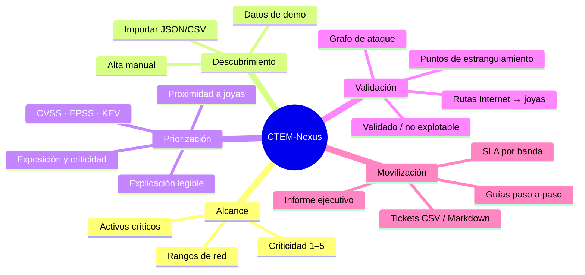
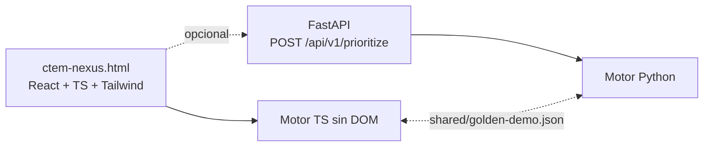

<p align="center">
  <b>Plataforma CTEM en el navegador: define el alcance, ingiere hallazgos, prioriza con una puntuación explicable, calcula las rutas de ataque hacia tus joyas de la corona y genera el informe ejecutivo y los tickets de remediación.</b>
</p>

<p align="center">
  <a href="https://heindall92.github.io/ctem-nexus/ctem-nexus.html"></a>
</p>

<p align="center">
  <a href="LICENSE"></a>
  
  
  
  
  
  
  
</p>

<p align="center">
  
</p>

CTEM-Nexus aplica el ciclo **CTEM** (*Continuous Threat Exposure Management*) de Gartner a un programa de
exposición real. Cada hallazgo recibe una **puntuación de 0 a 100** que combina:

- la **severidad** (CVSS);
- la **explotación en el mundo real** (catálogo CISA KEV, exploit público, EPSS);
- la **criticidad de negocio** y la **exposición a Internet** del activo;
- la **proximidad a las joyas de la corona**, medida en saltos sobre el grafo de ataque.

Además, enumera las rutas desde Internet hasta los activos de criticidad 5 y señala los **puntos de
estrangulamiento**: los nodos y aristas por los que pasa la mayoría de rutas, donde una corrección rompe más caminos.

Funciona en el navegador, sin servidor y sin conexión. Los datos del proyecto no salen del equipo.



## Cómo se usa

1. **Alcance.** Registra los activos (nombre, tipo, IP/CIDR, responsable, criticidad 1–5, exposición a Internet,
   etiquetas) y los rangos de red objetivo. Los activos de criticidad 5 son las **joyas de la corona**.
2. **Descubrimiento.** Importa hallazgos en JSON o CSV (hay plantilla), añádelos a mano o pulsa
   **Cargar datos de demo**.
3. **Priorización.** La tabla se ordena por puntuación. Abre un hallazgo para ver el desglose por factor, la
   explicación y la guía de remediación.
4. **Validación.** En *Rutas de ataque*, revisa el grafo, las rutas y los puntos de estrangulamiento, y marca
   cada hallazgo como **validado** (+5) o **no explotable** (×0,25 y sin arista).
5. **Movilización.** Imprime el informe ejecutivo o expórtalo en Markdown; exporta los tickets en CSV o Markdown.

> Los **datos de demo** son ficticios (8 activos y 20 hallazgos: Log4Shell CVE-2021-44228, ProxyShell
> CVE-2021-34473, Citrix Bleed CVE-2023-4966, cuenta *kerberoastable*, delegación sin restricciones, ADCS ESC1,
> firma SMB desactivada…). La interfaz los marca como **Datos de ejemplo**. Los valores de EPSS son orientativos.

## Vistas

| Vista | Qué muestra |
|---|---|
| **Panel** | Índice de exposición, hallazgos por banda, KEV abiertos, activos en riesgo, rutas, puntos de estrangulamiento, MTTR, estado de las 5 fases del ciclo CTEM y de los 4 módulos, y los riesgos principales. |
| **Alcance y activos** | Inventario de activos críticos y rangos de red; aviso de activos fuera de alcance. |
| **Descubrimiento y priorización** | Tabla priorizada con filtros, búsqueda, importación y panel de detalle con el desglose de la puntuación. |
| **Rutas de ataque** | Grafo SVG, puntos de estrangulamiento, rutas resaltables, validación de hallazgos y aristas manuales. |
| **Movilización** | Informe ejecutivo imprimible y guías de remediación con responsable, pasos, comando de verificación y SLA. |
| **Ajustes y datos** | Nombre del proyecto, motor (local o API), exportar/importar proyecto JSON, borrar datos. |

## Capturas

| | |
|---|---|
|  |  |
| **Panel** | **Descubrimiento y priorización** |
|  |  |
| **Detalle y desglose de la puntuación** | **Rutas de ataque y puntos de estrangulamiento** |
|  |  |
| **Movilización** | **Alcance y activos** |

## Arranque rápido

**Solo el HTML (recomendado).** Descarga [`ctem-nexus.html`](ctem-nexus.html) y ábrelo con doble clic. No hace
falta servidor ni conexión.

**Desarrollo de la interfaz** (Node ≥ 20):

```bash
cd frontend
npm install
npm run dev          # http://localhost:5173
npm test             # pruebas del motor (Vitest)
npm run build        # dist/ + dist/ctem-nexus.html + ../ctem-nexus.html
npm run capturas     # capturas 1440×900 en docs/screenshots (requiere Chromium)
```

**Backend opcional** (Python ≥ 3.11):

```bash
cd backend
python3 -m venv .venv && source .venv/bin/activate
pip install -r requirements-dev.txt
pytest
uvicorn app.main:app --reload --port 8000      # http://127.0.0.1:8000/docs
```

Después, en **Ajustes y datos › Motor de cálculo**, activa *Usar la API*. Si la API no responde, la interfaz
vuelve al motor local y lo indica en la barra superior.

## Arquitectura



- **Interfaz:** Vite 8, React 19, TypeScript, Tailwind CSS 4, Motion (muelles), Lucide, zustand. Con
  `vite-plugin-singlefile` se genera un único HTML con JS, CSS y fuentes incrustados.
- **Motor:** `frontend/src/engine/` (puntuación, grafo, rutas, estrangulamientos, importación/exportación, guías).
- **API:** FastAPI con un router por fase CTEM y modelos pydantic en camelCase (el mismo JSON que la interfaz).

Detalle en [`docs/ARCHITECTURE.md`](docs/ARCHITECTURE.md).

## Método de cálculo

```
puntuación = CVSS/10·30 + max(KEV, 0,6·exploit, EPSS)·25 + (criticidad−1)/4·20 + expuesto·10 + max(0, 1−saltos/4)·15
             validado: +5 (tope 100) · no explotable: ×0,25
Crítica ≥ 80 · Alta ≥ 60 · Media ≥ 40 · Baja < 40      SLA: 3 / 14 / 30 / 90 días
```

Fórmula completa, ejemplo resuelto, rutas y estrangulamientos en [`docs/SCORING.md`](docs/SCORING.md).

## Calidad

- **Motor TS:** 21 pruebas con Vitest (fórmula, bandas, grafo, rutas, estrangulamientos, importación CSV/JSON,
  neutralización de fórmulas, ida y vuelta del proyecto, fichero dorado).
- **Motor Python y API:** 15 pruebas con pytest, incluida la **paridad exacta** con el motor TS
  (puntuaciones, textos de explicación, rutas y resumen) mediante `shared/golden-demo.json`.
- **Compilación:** `tsc` estricto; el script de capturas falla si hay errores de consola, violaciones de CSP o
  peticiones externas.
- **CI:** `.github/workflows/ci.yml` (Vitest + build + pytest) y `pages.yml` (publicación en GitHub Pages).

## Seguridad y privacidad

- **Cero peticiones a terceros.** Fuentes autoalojadas e incrustadas; sin CDN, analítica ni telemetría.
- **CSP estricta** en el HTML: `default-src 'none'`, script y estilo permitidos solo por hash, `connect-src`
  limitado a `127.0.0.1`/`localhost` (API opcional).
- **Datos locales:** `localStorage` con caída a memoria; nada sale del equipo salvo que actives la API local.
- **Importación defensiva:** `JSON.parse` seguro (descarta `__proto__`, `constructor`, `prototype`), validación y
  saneado de cada campo, límite de tamaño de archivo.
- **CSV sin inyección de fórmulas:** las celdas que empiezan por `=`, `+`, `-`, `@`, tabulador o retorno de carro se
  prefijan con `'` (en la interfaz y en la API).
- **API:** CORS restringido a orígenes de desarrollo local, validación pydantic con límites, sin estado.

## Limitaciones conocidas

- Las señales (EPSS, KEV, exploit público) se introducen o importan: no hay sincronización automática con FIRST
  ni con CISA (la app no hace peticiones externas por diseño).
- El grafo se construye a partir de lo que declaran los hallazgos (`edgeFrom`/`leadsTo`) y las aristas manuales; no
  importa todavía BloodHound ni salidas de escáneres concretos (Nessus, Qualys…).
- Un único proyecto por navegador (exporta e importa JSON para cambiar de uno a otro).
- Disposición del grafo pensada para decenas de nodos; con cientos conviene filtrar.
- Interfaz optimizada para escritorio (≥ 1280 px).

## Estructura

```
ctem-nexus/
├── ctem-nexus.html            # aplicación autocontenida (se abre con doble clic)
├── frontend/
│   ├── src/
│   │   ├── engine/            # motor sin DOM + pruebas Vitest
│   │   ├── components/        # Shell, grafo SVG, primitivas de UI
│   │   ├── views/             # Panel, Alcance, Priorización, Rutas, Movilización, Ajustes
│   │   ├── store/ lib/ data/  # estado, almacenamiento, API, datos de demo
│   │   └── index.css          # sistema visual (tokens, movimiento, impresión)
│   ├── scripts/               # postbuild (CSP + copia) y capturas
│   └── vite.config.ts
├── backend/
│   ├── app/
│   │   ├── main.py            # FastAPI + CORS
│   │   ├── models.py          # pydantic (camelCase)
│   │   ├── routers/           # scoping, discovery, prioritization, validation, mobilization
│   │   └── engine/            # prioritization.py (misma fórmula)
│   └── tests/                 # pytest (paridad, motor, API)
├── shared/golden-demo.json    # fichero dorado de paridad TS ↔ Python
├── docs/                      # ARCHITECTURE.md, SCORING.md, screenshots/
└── .github/workflows/         # ci.yml, pages.yml
```

## Licencia

[GPL-2.0](LICENSE).

## Autor

**Yoandy Ramírez Delgado** · [@heindall92](https://github.com/heindall92)
