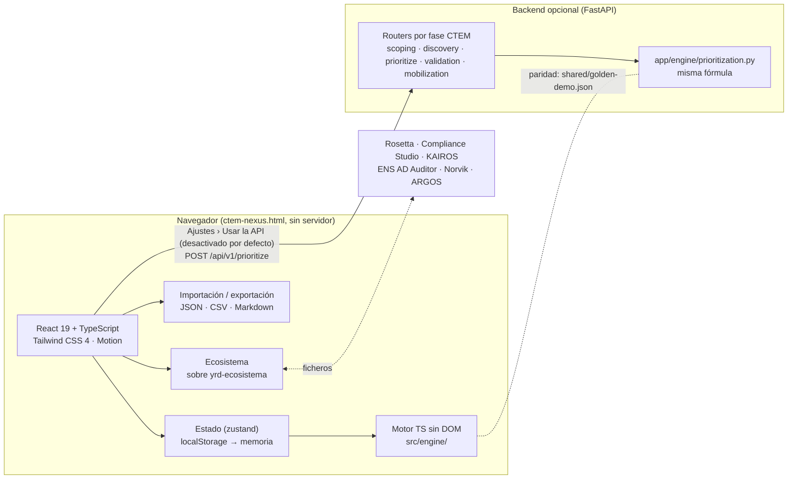

# Arquitectura · CTEM-Nexus

## Decisiones

| Decisión | Motivo |
|---|---|
| Un único HTML autocontenido (`vite-plugin-singlefile`) | Se abre con doble clic, sin servidor ni instalación, como Rosetta. JS, CSS y fuentes (Geist, autoalojada) van incrustados. |
| CSP estricta con hashes (`scripts/postbuild.mjs`) | `default-src 'none'`; solo el script y el estilo incrustados; `connect-src` limitado a `127.0.0.1`/`localhost` para la API opcional. Cero peticiones a terceros (lo comprueba `npm run capturas`). |
| Motor en TypeScript sin DOM | La aplicación funciona entera sin backend; el motor se prueba con Vitest en Node. |
| Backend FastAPI opcional | Para integrarlo en flujos (CI, SOAR, otros escáneres). Si no responde, la interfaz vuelve al motor local y lo indica. |
| Fichero dorado compartido | `npm run golden` lo genera desde el motor TS; `pytest` exige que Python dé exactamente lo mismo (puntuaciones, textos, rutas, resumen). |
| Grafo en SVG propio | Sin dependencias pesadas (Cytoscape/React Flow). Disposición por columnas según la distancia BFS desde Internet. |
| Vistas cargadas bajo demanda (`React.lazy`) | En Pages solo el panel va en el arranque; el resto de vistas, la ayuda y la búsqueda se precargan con el navegador libre. Lighthouse de rendimiento: 93 → 96 (mediana, con gzip). En el HTML autocontenido todo sigue en un único fichero. |
| Integración por fichero, nunca por red | Las herramientas del ecosistema intercambian un sobre JSON común (`shared/schemas/yrd-ecosistema.schema.json`). Cada importación enseña qué cambiará antes de aplicarlo. Ver [ECOSISTEMA.md](ECOSISTEMA.md). |

## Módulos de la interfaz

| Vista | Fase CTEM | Fichero |
|---|---|---|
| Panel | Todas | `frontend/src/views/Dashboard.tsx` |
| Alcance y activos | Alcance | `frontend/src/views/Scoping.tsx` |
| Descubrimiento y priorización | Descubrimiento + Priorización | `frontend/src/views/Prioritization.tsx` |
| Rutas de ataque | Validación | `frontend/src/views/AttackPaths.tsx` + `components/AttackGraph.tsx` |
| Mapa ATT&CK | Validación | `frontend/src/views/MitreMatrix.tsx` + `engine/attack.ts` |
| ¿Y si…? | Priorización + Movilización | `frontend/src/views/Simulation.tsx` + `engine/simulate.ts` |
| Movilización | Movilización | `frontend/src/views/Mobilization.tsx` |
| Ecosistema | Todas | `frontend/src/views/Ecosystem.tsx` + `engine/ecosystem.ts` y `engine/controls.ts` |
| Ajustes y datos | — | `frontend/src/views/Settings.tsx` |

## API

| Método | Ruta | Descripción |
|---|---|---|
| GET | `/health` | Estado y versión del motor. |
| POST | `/api/v1/prioritize` | `EngineInput` → `EngineResult` (mismo JSON que el motor TS, `engine: "python"`). |
| POST | `/api/v1/scoping/validate` | Valida IP/CIDR y avisa de activos fuera de los rangos en alcance. |
| POST | `/api/v1/discovery/import-csv` | CSV (`,` o `;`) → hallazgos. |
| POST | `/api/v1/validation/attack-paths` | Rutas, aristas y puntos de estrangulamiento. |
| POST | `/api/v1/mobilization/tickets.csv` | Tickets en CSV con fórmulas neutralizadas. |

Documentación interactiva en `http://127.0.0.1:8000/docs` con el backend arrancado.

## Diseño y movimiento

- Oscuro casi negro frío o claro gris perla, un solo acento (azul eléctrico por defecto, siete a elegir, los de Rosetta);
  los colores de banda solo transmiten prioridad. Sin anillos ni gráficos circulares (son el sello de Rosetta): el panel
  usa franjas de exposición por activo.
- Superficies unificadas con divisiones finas en lugar de tarjetas fragmentadas; material translúcido solo donde hay
  capas superpuestas (barra superior fija, panel lateral, avisos), más grueso cuanto mayor es la superficie.
- Monoespaciada (Geist Mono) para IDs, CVE, IP y puntuaciones de tabla; cifras grandes en Geist con numerales tabulares
  y tracking negativo.
- Movimiento: muelles críticamente amortiguados (`bounce: 0`, ~0,3 s) para el indicador de navegación, controles
  segmentados, panel lateral y avisos (interrumpibles); transiciones CSS con `cubic-bezier(0.23, 1, 0.32, 1)` por debajo
  de 300 ms; `scale(0.97)` al pulsar; entrada de vistas con `@starting-style`; salida del panel más rápida que la entrada
  y por el mismo borde. `prefers-reduced-motion` sustituye desplazamientos por fundidos; `prefers-reduced-transparency`
  y `prefers-contrast` vuelven sólidos los materiales.
