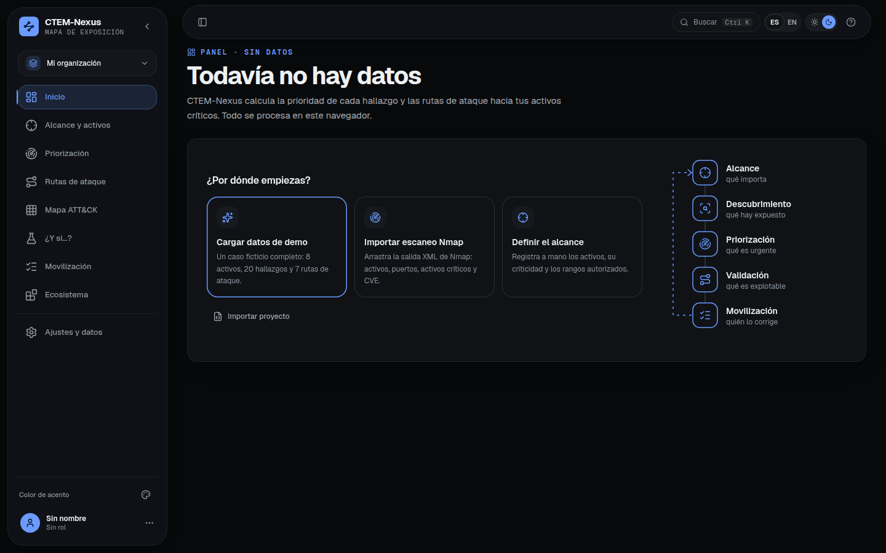
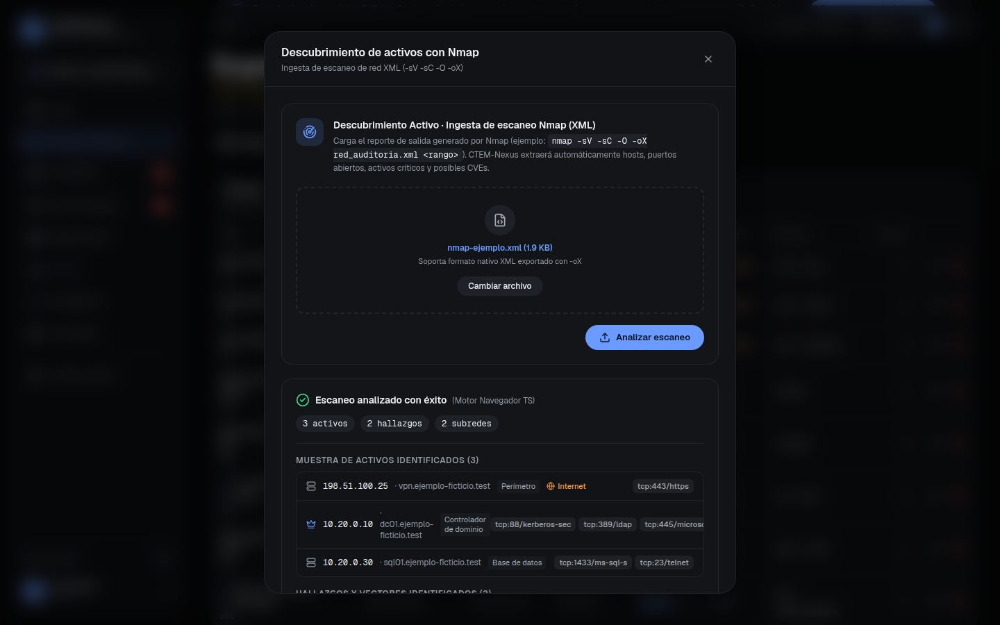
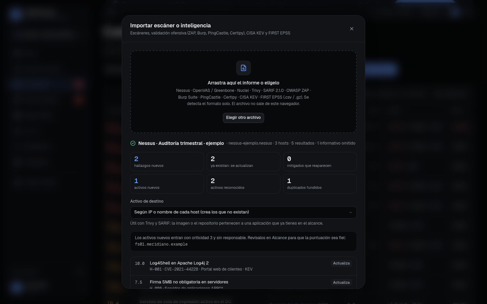
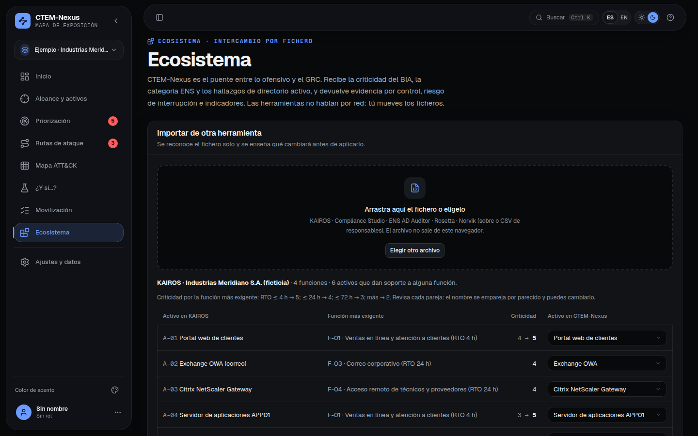
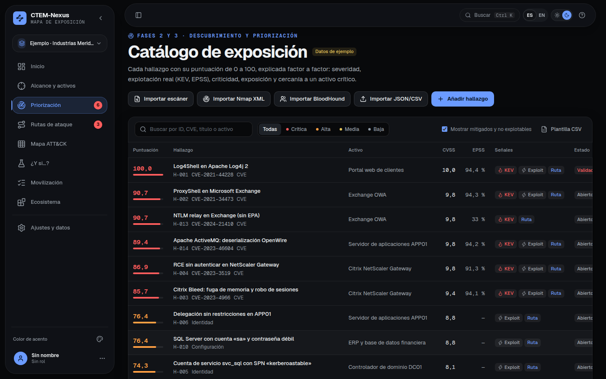
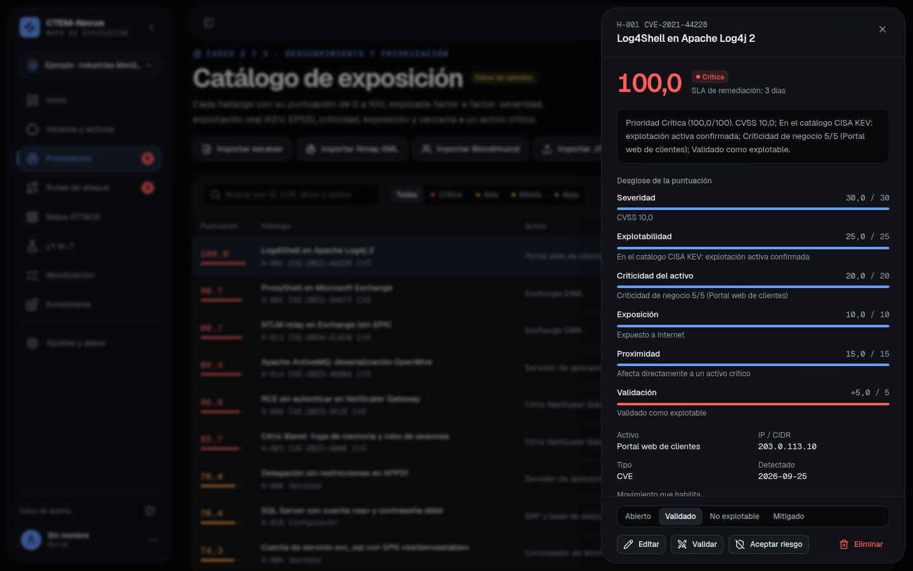
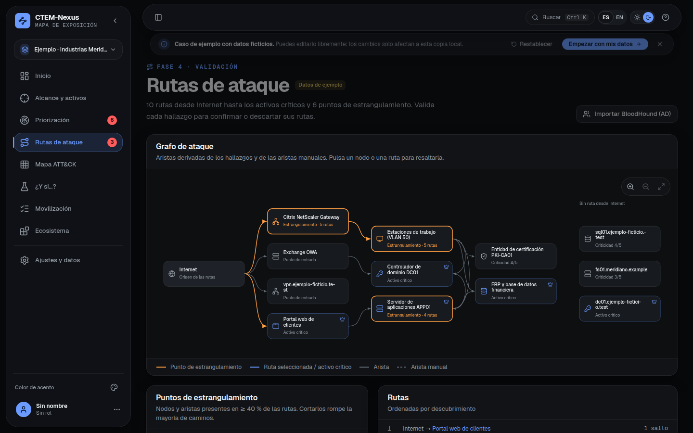
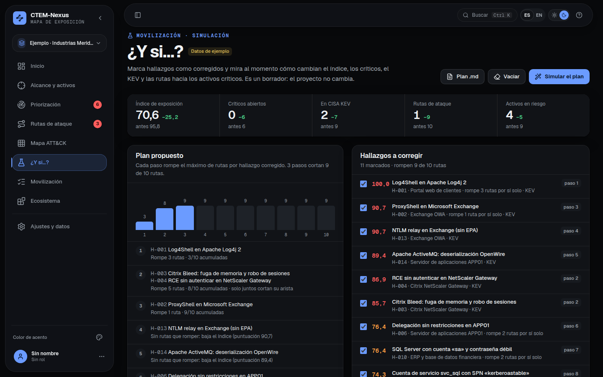
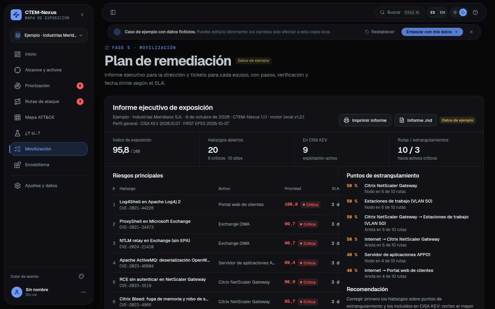
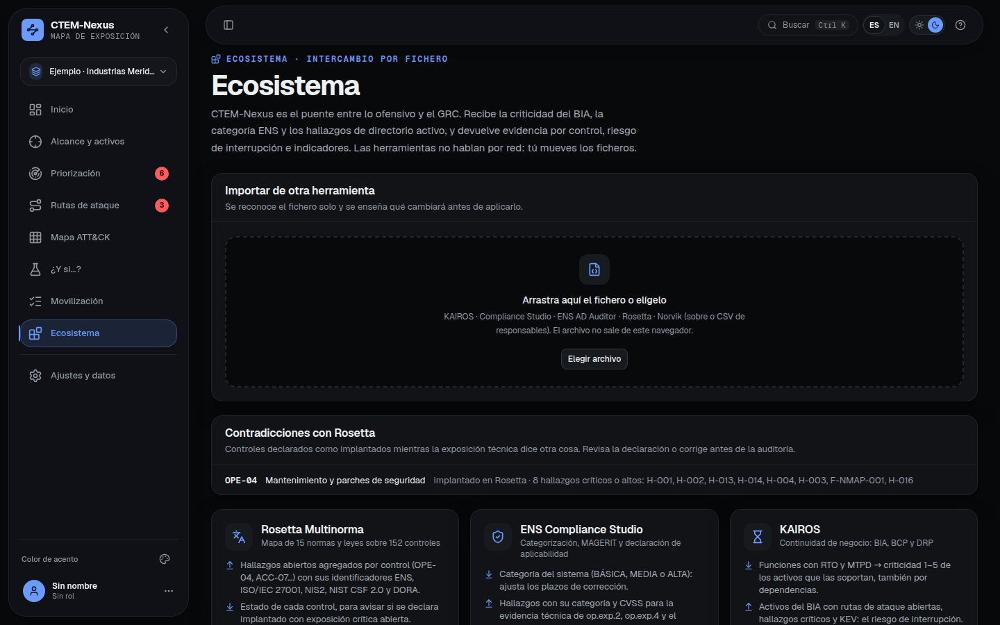

# De un Nmap a un plan de remediación con SLA en 10 minutos

Guía práctica de CTEM-Nexus 1.1. Partes de un escaneo de red y terminas con un plan ordenado, plazos de corrección,
tickets para Jira y un informe para la dirección. Todo ocurre en tu navegador: ningún fichero sale del equipo.

**Qué necesitas.** La herramienta en <https://heindall92.github.io/ctem-nexus/> (o el fichero `ctem-nexus.html`, que se
abre sin instalar nada) y los ficheros de ejemplo: en la app, **Ayuda → Ingesta de datos → Ficheros de ejemplo**. Son
ficticios y encajan con el caso de demostración, *Industrias Meridiano*. Con tus propios datos el recorrido es el mismo.



---

## 1. Alcance: qué entra y qué es crítico (1 minuto)

Pulsa **Cargar datos de demo** para tener un escenario completo y entra en **Alcance y activos**. Allí están los rangos
en alcance y los activos con su criticidad de negocio (1 a 5). Los **activos críticos** son los de criticidad 5: el
controlador de dominio y el ERP.

Importa tu escaneo con **Importar Nmap XML**:

```bash
nmap -sV -sC -oX escaneo.xml 10.10.0.0/16
```

CTEM-Nexus lo analiza en el navegador (sin DTD ni entidades: un XML malicioso se rechaza), detecta los servicios
expuestos y propone los activos nuevos.



## 2. Descubrimiento: el escáner, sin duplicados (2 minutos)

En **Priorización → Importar escáner** arrastra el informe de Nessus, OpenVAS, Nuclei, Trivy o SARIF. Antes de tocar
nada, la app enseña el plan: hallazgos nuevos, los que ya existían y se actualizan, los mitigados que reaparecen (se
reabren como regresión), activos nuevos y duplicados fundidos. Importar dos veces el mismo informe no duplica nada.



Después, importa el catálogo **CISA KEV** y el CSV de **FIRST EPSS** del día. La app nunca los descarga por su cuenta:
los traes tú y su versión queda anotada en el proyecto y en el informe.

## 3. Contexto de negocio: el BIA y la categoría ENS (1 minuto)

La criticidad no debería inventarse. En **Ecosistema**, arrastra el proyecto de **KAIROS**: cada función con su RTO
fija la criticidad de los activos que la soportan, también a través de las dependencias. Si el portal depende del
servidor de aplicaciones, este hereda la urgencia de la venta en línea. Revisas cada pareja antes de aplicar.



Si estás en el ámbito del ENS, arrastra también el proyecto de **ENS Compliance Studio**: su categoría (BÁSICA, MEDIA o
ALTA) ajusta los plazos. En una categoría ALTA, un hallazgo crítico pasa de 3 a 2 días.

> **Banca y finanzas.** En **Ajustes → Perfil de ponderación**, el perfil *Banca y finanzas* da más peso a la
> explotación real y a la exposición a Internet, que es lo que miran DORA y las pruebas TLPT. En Latinoamérica sirve
> igual para entidades supervisadas por la CMF de Chile, la SFC de Colombia, la CNBV de México o la SBS de Perú.

## 4. Priorización explicada (2 minutos)

Cada hallazgo tiene una puntuación de 0 a 100 que se puede auditar:

```
severidad (CVSS) + explotabilidad (KEV, exploit público, EPSS) + criticidad del activo + exposición + proximidad a un activo crítico
```



Abre un hallazgo: verás el desglose de cada factor, la explicación en una frase, la guía de remediación con casillas,
las técnicas ATT&CK, los **controles afectados** (ENS, ISO/IEC 27001, NIS2, NIST CSF 2.0 y DORA) y la máquina de
**ARGOS** donde practicar la corrección.



## 5. Rutas de ataque: dónde cortar (1 minuto)

**Rutas de ataque** dibuja los caminos desde Internet hasta los activos críticos y marca los **puntos de
estrangulamiento**: los nodos por los que pasan muchas rutas. Corregir ahí rompe más caminos con menos esfuerzo.



**Valídalo.** Si tienes resultados de un pentest, importa también **OWASP ZAP**, **Burp Suite**, **PingCastle** o
**Certipy** por el mismo importador. En la ficha de cada hallazgo, **Validar** registra quién lo probó, cuándo, con qué
técnica y el resultado: «explotado» sube su prioridad y «no explotable» corta sus rutas en el grafo.

## 6. ¿Y si…?: el orden que más rutas rompe (1 minuto)

En **¿Y si…?** pulsa **Simular el plan**. La app propone el orden de corrección que corta más rutas por hallazgo (y
junta los que solo cortan su arista a la vez), y enseña el antes y el después del índice, los críticos y las rutas.
Nada cambia en el proyecto hasta que tú lo decidas.



## 7. Movilización: plazos, tickets e informe (2 minutos)

**Movilización** reúne lo que hay que mover:

- **Cumplimiento de plazos (SLA)** global, por prioridad y por responsable, con lo que ya está vencido.
- **Tickets** con pasos, verificación y fecha límite, en CSV, Markdown, **Jira** (asistente de importación) y
  **GitHub Issues**.
- **Informe para la dirección**: portada, una página con cinco acciones y tendencia, y anexo técnico. Se imprime o se
  guarda en PDF desde el navegador ([ejemplo](informe-ejemplo.pdf)).
- **Cierre de ciclo**: guarda una instantánea para comparar el mes que viene.
- **Verificación (*retest*)**: lo que marcas como mitigado queda pendiente hasta que el escaneo siguiente de la misma
  herramienta deja de verlo; si reaparece, se reabre y cuenta en la tasa de reapertura.



## 8. Cerrar el círculo con el GRC

En **Ecosistema → Rosetta → Evidencia por control** descargas los hallazgos agrupados por control. En
[Rosetta Multinorma](https://heindall92.github.io/rosetta_multinorma/) se importan en **Exportar → CTEM-Nexus**: cada
control enseña su exposición técnica y la regla **CO-23** avisa si figura como implantado con hallazgos críticos
abiertos. Al traer de vuelta el sobre de Rosetta, CTEM-Nexus marca esas contradicciones antes de que las encuentre un
auditor.



---

**Siguiente paso.** Repite el ciclo cada mes: importa el escáner nuevo (lo corregido desaparece de los abiertos y lo que
reaparece se reabre), cierra el ciclo y compara. La tendencia del informe te dirá si la exposición baja de verdad.

*Las capturas se generan con `npm run guia` a partir de la interfaz real y de los ficheros de ejemplo.*
